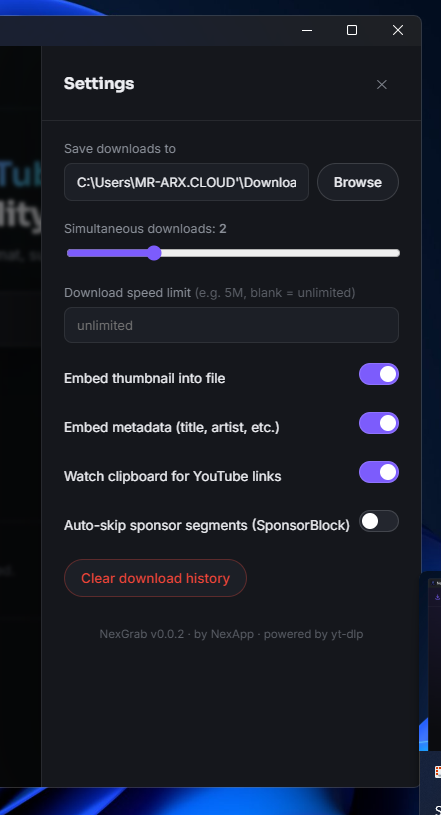
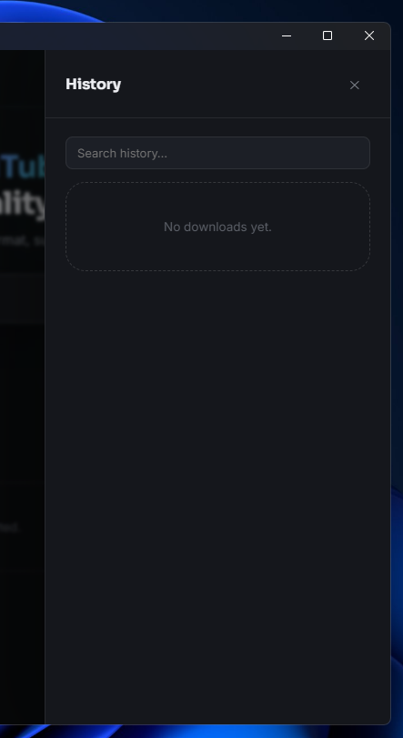

# NexGrab

> A clean, capable desktop downloader for YouTube video and audio, built with Electron and yt-dlp.


NexGrab makes it simple to download videos, extract audio, manage playlists, save subtitles, and keep a history of your downloads from one focused desktop app.

## Download

Grab the latest build for your platform from the [Releases page](https://github.com/nexerisltd/NexGrab-Desktop/releases/latest), or use the direct links below — these are updated automatically by CI on every release.

### Windows
<!-- DOWNLOAD_WIN_START -->
[](https://github.com/nexerisltd/NexGrab-Desktop/releases/download/v2.1.0/NexGrab-Setup-2.1.0-win64.exe)

Download and run **NexGrab Setup 2.1.0 for Windows (64-bit)**.
<!-- DOWNLOAD_WIN_END -->

### macOS
<!-- DOWNLOAD_MAC_START -->
[](https://github.com/nexerisltd/NexGrab-Desktop/releases/download/v2.1.0/NexGrab-2.1.0-arm64.dmg)
<!-- DOWNLOAD_MAC_END -->

### Linux
<!-- DOWNLOAD_LINUX_START -->
[](https://github.com/nexerisltd/NexGrab-Desktop/releases/download/v2.1.0/NexGrab-2.1.0.AppImage)
<!-- DOWNLOAD_LINUX_END -->

## Highlights

| | Feature |
| --- | --- |
| Video | Download video up to 4K/8K quality. |
| Audio | Extract MP3, M4A, Opus, FLAC, or WAV audio. |
| Playlists | Download complete playlists and manage a bulk queue. |
| Clips | Save only the part you need with start and end timestamps. |
| Subtitles | Download subtitles and use SponsorBlock support. |
| Workflow | Use history, clipboard watching, speed limits, themes, and persistent save locations. |

## Screenshots

### Home


### Settings



### History



## Run Locally

**Requirements:** Node.js 18 or newer.

```bash
npm install
npm start
```

## Build From the Project Root

```bash
npm run dist
```

This runs `electron-builder` and creates the platform-specific distributable. On Windows, the installer is written to `dist/NexGrab-Setup-2.1.0-win64.exe`.

## Development Notes

- `yt-dlp` and `ffmpeg` are **not** bundled in the installer. On first launch, `binaryManager.js` downloads the latest builds straight from their upstream sources into `app.getPath('userData')/bin/` and keeps them there — a fresh, minimal installer with nothing to go stale.
- A background check runs shortly after startup and once every 24 hours after that, silently updating either binary if a newer build is available.
- Settings → Dependencies shows the installed versions and offers a manual "Check for updates" and "Re-download" (troubleshooting) action.
- If the initial download fails (no internet, blocked network, etc.), the app shows a clear retry screen instead of crashing or silently failing.
- YouTube's SABR streaming rollout can serve formats with no direct URL to some player clients. Downloads automatically retry through a `tv → mweb → ios → web_creator` client fallback chain when this happens; an optional local PO Token provider sidecar (`bgutil-ytdlp-pot-provider`, toggled in Settings) can be enabled for videos that need one even with the fallback chain.

## Releasing a New Version

Releases are fully automated by `.github/workflows/release.yml` — pushing a version tag is the only manual step:

```bash
npm version 2.2.0 --no-git-tag-version   # bump package.json's "version"
git add package.json
git commit -m "chore: bump version to 2.2.0"
git tag v.2.2.0
git push origin main --tags
```

Pushing the tag triggers CI to:
1. Build the Windows, macOS, and Linux installers in parallel (one job per OS, since electron-builder needs each platform's own runner to produce a working native installer).
2. Publish all three as assets on a new GitHub Release for that tag.
3. Rewrite the download links and version number in this README and commit that back to `main` automatically.

Notes:
- Windows/macOS builds are unsigned (`forceCodeSigning: false`) — Windows SmartScreen and macOS Gatekeeper will show an "unknown publisher" warning until/unless the app is code-signed with a real certificate.
- If branch protection on `main` blocks the default `GITHUB_TOKEN` from pushing, add a personal access token with `repo` scope as a repository secret (e.g. `RELEASE_PAT`) and swap it in for `secrets.GITHUB_TOKEN` in the `update-readme` job's checkout/push steps.

## Responsible Use

NexGrab uses `yt-dlp` locally and does not require accounts or tracking. Please respect YouTube's Terms of Service and applicable copyright laws.
